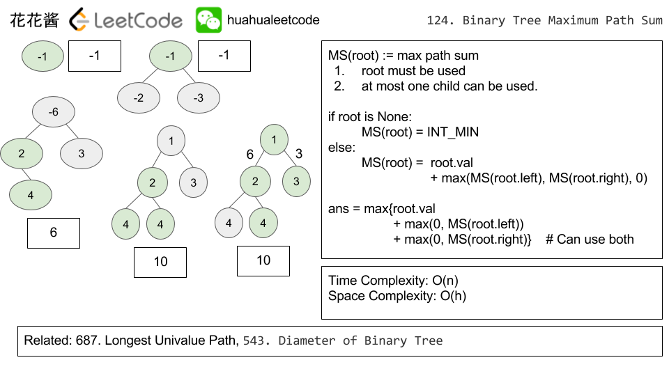

# 124. 二叉树中的最大路径和

[链接](https://leetcode-cn.com/problems/binary-tree-maximum-path-sum/description/)

给定一个**非空**二叉树，返回其最大路径和。

本题中，路径被定义为一条从树中任意节点出发，达到任意节点的序列。该路径**至少包含一个**节点，且不一定经过根节点。

**示例 1:**

```
输入: [1,2,3]

       1
      / \
     2   3

输出: 6
```

**示例 2:**

```
输入: [-10,9,20,null,null,15,7]

   -10
   / \
  9  20
    /  \
   15   7

输出: 42
```

**思路分析**

[参考链接](https://www.youtube.com/watch?v=9ZNky1wqNUw)



使用递归方法

该递归函数的作用为：

- 计算包括左右孩子加上自身的路径和，查看是否可以更新最大值
- 返回其中一个孩子和自身的路径和

注意：

孩子节点为负值，则不取

计算结果时，计算root+left+right

返回结果时（表示需要回到父节点，此时不可能包含左右孩子），返回man(left,right)+root


**我的实现**

```c++
/**
 * Definition for a binary tree node.
 * struct TreeNode {
 *     int val;
 *     TreeNode *left;
 *     TreeNode *right;
 *     TreeNode(int x) : val(x), left(NULL), right(NULL) {}
 * };
 */
class Solution {
public:
    int maxPathSum(TreeNode* root) {
        if(root==nullptr) return 0;
        int res = INT_MIN;
        helper(root, res);
        return res;
    }
private:
    int helper(TreeNode* root, int& res)
    {
        if(!root) return INT_MIN;
        //如果左孩子的路径值和大于0，则设为该值
        //否则，为0，表示不取left节点
        int left = max(0, helper(root->left,res)); 
        int right = max(0, helper(root->right,res));
        int sum = left + right + root->val;
        res = max(res, sum);
        //这里只能取左右孩子中的最大值加上自身的值作为路径和
        //因为如果左右孩子都取，则不能作为返回的路径
        return max(left,right) + root->val;
    }
};
```

