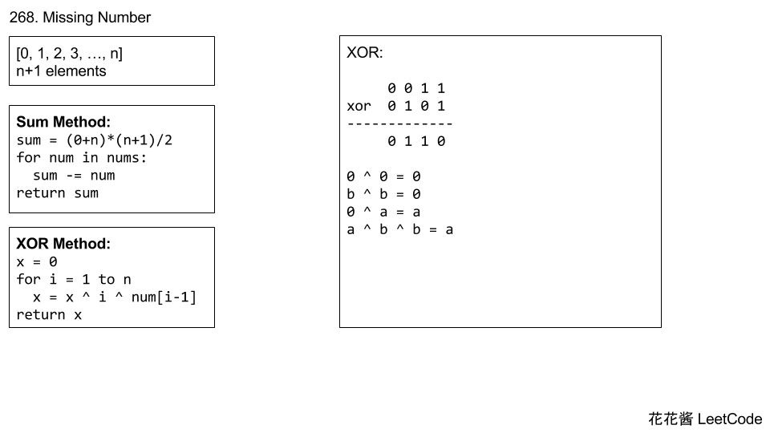

# 268. 缺失数字

[链接](https://leetcode-cn.com/problems/missing-number/description/)

给定一个包含 `0, 1, 2, ..., n` 中 *n* 个数的序列，找出 0 .. *n* 中没有出现在序列中的那个数。

**示例 1:**

```
输入: [3,0,1]
输出: 2
```

**示例 2:**

```
输入: [9,6,4,2,3,5,7,0,1]
输出: 8
```

**说明:**
 你的算法应具有线性时间复杂度。你能否仅使用额外常数空间来实现?

**思路分析1**

将0~n的和减去数组中存在的数，将是丢失的那个数字

0~n的和为`(0+n)*(n+1)/2`

**我的实现1**

```c++
class Solution {
public:
    int missingNumber(vector<int>& nums) {
        if(nums.empty()) return false;
        int n = nums.size();
        int sum = n*(n+1)/2;
        for(int i=0; i<n; ++i)
            sum -= nums[i];
        return sum;
    }
};
```

**思路分析2**

异或法



**我的实现2**

```c++
class Solution {
public:
    int missingNumber(vector<int>& nums) {
        int res = 0;
        int n = nums.size();
        for(int i=0; i<=n; ++i)
        {
            res ^= i;
            if(i!=n) res ^= nums[i];
        }
        return res;
    }
};
```

