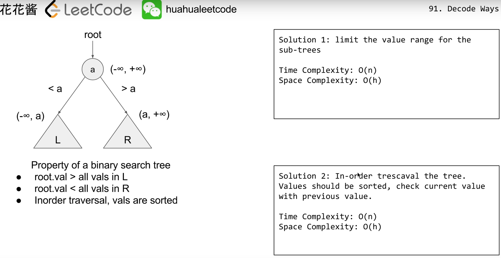

# 98. 验证二叉搜索树

[链接](https://leetcode-cn.com/problems/validate-binary-search-tree/description/)

给定一个二叉树，判断其是否是一个有效的二叉搜索树。

一个二叉搜索树具有如下特征：

- 节点的左子树只包含**小于**当前节点的数。
- 节点的右子树只包含**大于**当前节点的数。
- 所有左子树和右子树自身必须也是二叉搜索树。

**示例 1:**

```
输入:
    2
   / \
  1   3
输出: true
```

**示例 2:**

```
输入:
    5
   / \
  1   4
     / \
    3   6
输出: false
解释: 输入为: [5,1,4,null,null,3,6]。
     根节点的值为 5 ，但是其右子节点值为 4 。
```

**思路分析**

使用递归

对于每次递归，需要传入一个范围值，设父节点的范围值为(minNum,maxNum)，父节点值为val

- 当被遍历的节点是其父节点的左节点时，其范围值应为(minNum,min(val,maxNum))
- 当被遍历的节点是其父节点的右节点时，其范围值为(max(val,minNum),maxNum)

注意：考虑某节点值为INT_MAX或INT_MIN的情况，我们所有计算都使用long long表示

**我的实现**

```c++
/**
 * Definition for a binary tree node.
 * struct TreeNode {
 *     int val;
 *     TreeNode *left;
 *     TreeNode *right;
 *     TreeNode(int x) : val(x), left(NULL), right(NULL) {}
 * };
 */
 class Solution {
 public:
	 bool isValidBSTCore(TreeNode* root, long long minNum, long long maxNum)
	 {
		 if (root == nullptr)
			 return true;
		 if (root->val <= minNum || maxNum <= root->val)
                return false;
			 
		 bool isOK = true;
		 if (root->left != nullptr)
		 {
			 long long tempMax = min((long long)root->val, maxNum);
			 isOK = isValidBSTCore(root->left, minNum, tempMax);
		 }

		 if (isOK && root->right != nullptr)
		 {
			 long long tempMin = max((long long)root->val, minNum);
			 isOK = isValidBSTCore(root->right, tempMin, maxNum);
		 }
		 return isOK;
	 }
	 bool isValidBST(TreeNode* root)
	 {
		 return isValidBSTCore(root, LLONG_MIN, LLONG_MAX);
	 }
 };
```

## 二刷

[参考链接](https://www.youtube.com/watch?v=Jq0Wk9xeQ0U)



**方法一：值范围1**

使用long long表示最大值、最小值

```c++
/**
 * Definition for a binary tree node.
 * struct TreeNode {
 *     int val;
 *     TreeNode *left;
 *     TreeNode *right;
 *     TreeNode(int x) : val(x), left(NULL), right(NULL) {}
 * };
 */
class Solution {
public:
    bool isValidBST(TreeNode* root) {
        return isValidBST(root,LLONG_MIN,LLONG_MAX);
    }
private:
    bool isValidBST(TreeNode* root, long long minVal, long long maxVal)
    {
        if(!root) return true;
        if(root->val <= minVal || root->val >= maxVal)
            return false;
        if(!isValidBST(root->left,minVal,root->val)) //对于左子树，限制其最大值
            return false;
        return isValidBST(root->right,root->val,maxVal); //对于右子树，限制其最小值
    }
};
```

**方法二：值范围2**

使用nullptr表示无穷大或无穷小

```c++
/**
 * Definition for a binary tree node.
 * struct TreeNode {
 *     int val;
 *     TreeNode *left;
 *     TreeNode *right;
 *     TreeNode(int x) : val(x), left(NULL), right(NULL) {}
 * };
 */
class Solution {
public:
    bool isValidBST(TreeNode* root) {
        return isValidBST(root,nullptr,nullptr);
    }
    bool isValidBST(TreeNode* root, int* minVal, int* maxVal)
    {
        if(!root) return true;
        if( (minVal && root->val<=*minVal) || (maxVal && root->val>=*maxVal))
            return false;
        if(!isValidBST(root->left,minVal,&root->val))
        	return false;
        return isValidBST(root->right,&root->val,maxVal);
    }
};
```

**方法三：中序遍历**

```c++
/**
 * Definition for a binary tree node.
 * struct TreeNode {
 *     int val;
 *     TreeNode *left;
 *     TreeNode *right;
 *     TreeNode(int x) : val(x), left(NULL), right(NULL) {}
 * };
 */
class Solution {
public:
    Solution():prev(nullptr){}
    bool isValidBST(TreeNode* root) {
        if(!root) return true;
        if(!isValidBST(root->left))
            return false;
        if(prev && root->val <= prev->val)
            return false;
        prev = root;
        return isValidBST(root->right);
    }
private:
    TreeNode* prev;
};
```

